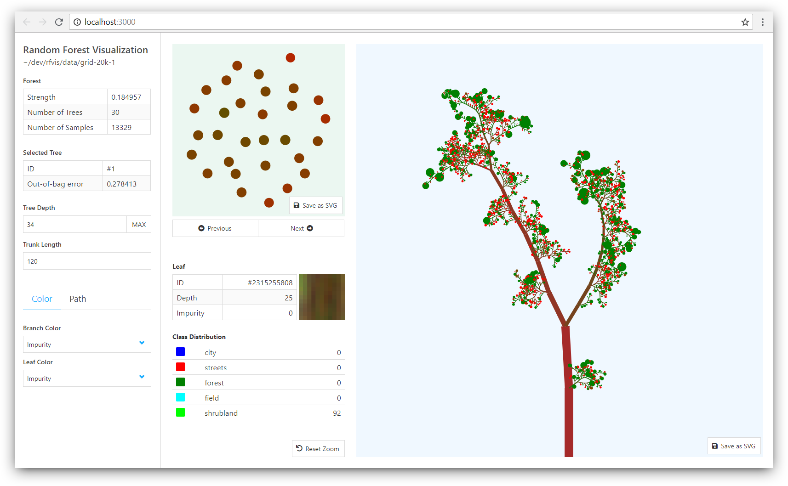

# Random Forest Visualization Tool

A tool for visualizing the structure and performance of Random Forests.


## Getting Started 

As prerequisites you need [Node.js](https://nodejs.org/en/download/) an a local copy of this repository. 
To install all required project dependencies run:
```
$ npm install
```

The web-based GUI is currently only tested on Google Chrome.

### Build

To build the project run:
```
$ npm run build
```
This will generate a `./dist` folder which contains the "compiled" Javascript files for the frontend and backend, as well as the necessary assets and HTML.

### Run
TODO
The entrypoint of the tool is the `./dist/index.js` which is generated in the previous build step.

The tool offers a command line interface to either generate SVG files directly from your input data (`rfvis cli <data>`) or to spin up a web-based GUI for a more interactive analysis (`rfvis gui <data>`).

To see all available commands run:
```
$ node rfvis

rfvis [command]

Commands:
  rfvis cli <data>  Command line interface to generate SVGs
  rfvis gui <data>  Graphical User Interface

Options:
  --help     Show help                                                 [boolean]
  --version  Show version number                                       [boolean]
```

## The Command Line Interface
To use the command line interface and generate SVG files for each tree in the input data, run:
```
$ rfvis cli /path/to/data --out result
>> Exported "/dev/random-forest-visualization/result/tree-0.svg"
>> Exported "/dev/random-forest-visualization/result/tree-1.svg"
>> Exported "/dev/random-forest-visualization/result/tree-2.svg"
>> Exported "/dev/random-forest-visualization/result/tree-3.svg"
...
```

Get a full list of available options with `--help`:
```
$ rfvis --help
rfvis cli <data>

Command line interface to generate SVGs

Positionals:
  data  Folder containing the forest data                             [required]

Options:
  --help               Show help                                       [boolean]
  --version            Show version number                             [boolean]
  --out, -o            Output folder for the SVG files. If omitted the current
                       working directory is used.
  --width, -w          Width of the SVG                  [number] [default: 800]
  --height, -h         Height of the SVG                 [number] [default: 800]
  --trunk-length, -t   Length of the trunk which influences the entire tree size
                                                         [number] [default: 100]
  --depth, -d          Depth of the tree rendering. Cut of leaves are visualized
                       as pie chart consolidation nodes.                [number]
  --leaf-color         Color of the leaves. Either the leaf impurity or the
                       class assigned to the leaf.
                            [choices: "impurity", "class"] [default: "impurity"]
  --branch-color       Color of the branches. Either the node impurity or the
                       node drop-of-impurity.
                    [choices: "impurity", "impurity-drop"] [default: "impurity"]
```

## The Graphical User Interface
To interactively analyze your forest with the web-based GUI run:
```
$ rfvis gui /path/to/data
Starting server
GUI running at http://localhost:3000
```
You can now open up your browser at <http://localhost:3000> to see something like this:



As the computation of the forest visualization is relatively slow, the server starts right away. The computation is 
carried out in the background and the forest will pop up in the frontend automatically once its done.


## Input Data
The input data is expected to come in text files in the following folder structure:
- `./forest.txt`: A text file containing the correlation matrix, tree strengths and overall forest strength
- `./tree_<index>.txt`: One text file per tree in the forest with semicolon-separated values in the following format:
    - `Internal nodes`: height;  -; 0; size; impurity; drop of impurity; splitting grade; list of used feature IDs; fusion ID; path prediction, split point def; list of score IDs
    - `Leaf nodes`: height; ID; 1; size; impurity; class frequency


## Development
In order to make development more convenient (which means not having to run `npm run build` after every change) you can run watchers on the source files. The recommended setup for development is to open two terminal processes and run:
1. `npm run watch:frontend` to automatically build any changes in the frontend related JS or SCSS files
2. `npm run watch:backend` to automatically build any changes in the command line interface or the server related JS files

Note that many files are used by the frontend _and_ backend, e.g. the logic for constructing and drawing the trees. A change to `./src/draw_tree.js` will therefore trigger both watchers.


## Built With

* [D3.js](https://d3js.org/) - Data Visualization Library
* [Yargs](https://github.com/yargs/yargs) - Command Line Parsing Library
* [Bulma](https://bulma.io/) - Lightweight CSS Framework
* [Express](https://expressjs.com/) - Web Application Framework
* [rollup.js](https://rollupjs.org/) - Module Bundler / Build Tool